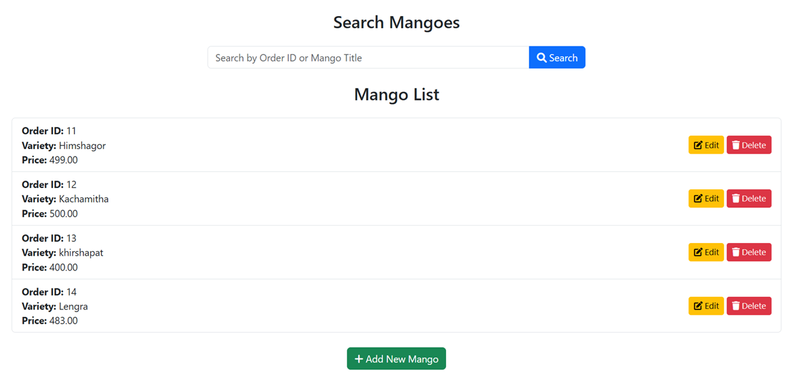
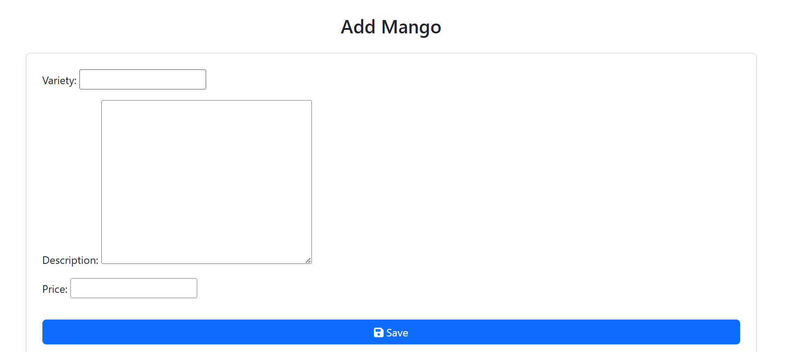

# 🥭 Mango Export Management - Django App

A basic Django web application for managing exported mango varieties. This project allows users to add, update, delete, and search mango records.

## 🚀 Features

- Add new mango varieties with:
  - Name/Variety
  - Description
  - Price
- Edit existing mango details
- Delete mango entries
- Search for mangoes by name/variety

## 🛠️ Tech Stack

- **Backend**: Django (Python)
- **Database**: SQLite (default)
- **Frontend**: HTML, CSS (Django Templates)


## 🧑‍💻 How to Run

> ⚠️ No virtual environment (`venv`) was used in this setup.

1. **Install Django** (if not already installed globally):

```bash
pip install django
```

2. **Clone the project and navigate to the directory**
```bash
git clone https://github.com/yourusername/mango-export-app.git
cd mango-export-app
```
3. **Apply migrations**
```bash
python manage.py migrate
```
4. **Run the development server**
```bash
python manage.py runserver
```
5. Visit the app in your browser
```bash
http://127.0.0.1:8000/
```
## ✨ Screenshots

### 🧾 Mango List Page


### ➕ Add Mango Form



